# Lab6Web

## Nama: Bagus aditya hermawan
## Nim: 312410382
## Kelas: TI.24.A.3
## Mata Kuliah: Pemrogramana Web 1

### Langkah-langkah Praktikum

### Membuat file index.html

#### 1. Membuat Set up Bootstrap
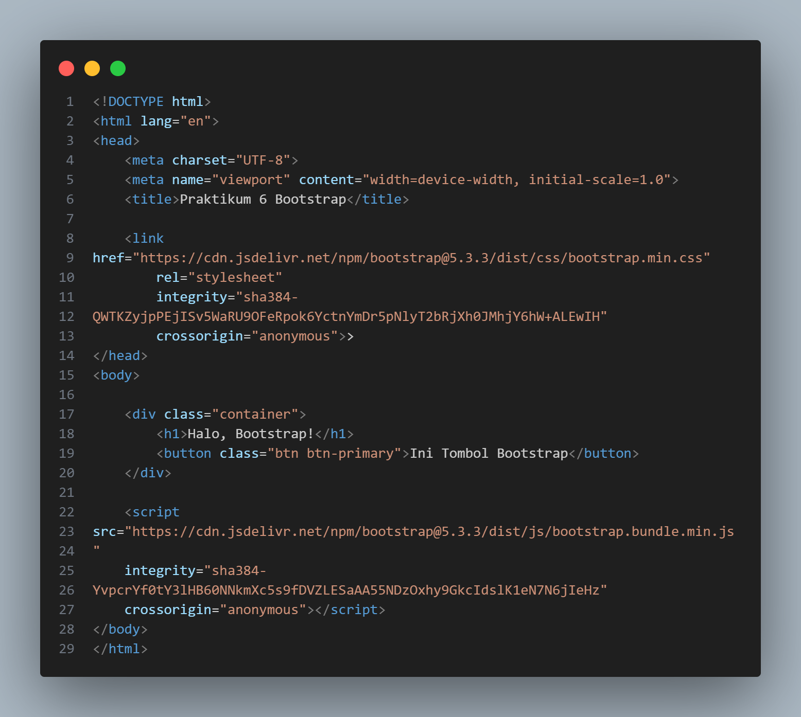

#### 2. Membuat Container
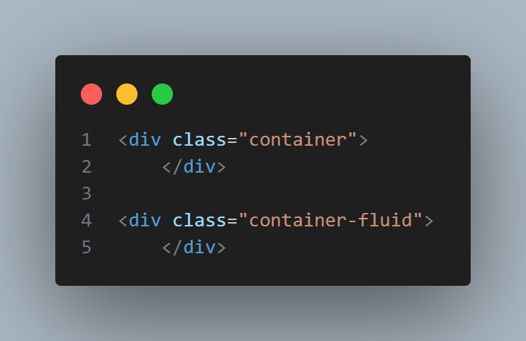

#### 3. Membuat Grid System
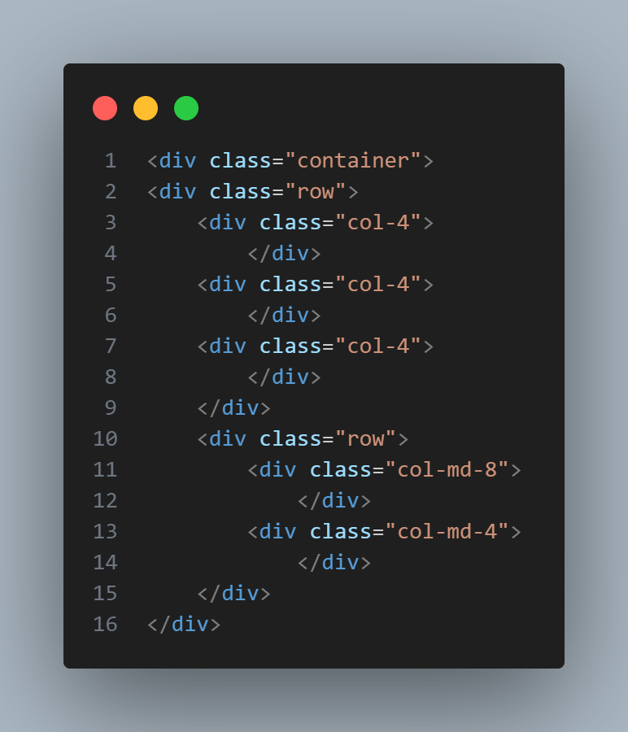

#### 4. Membuat Button
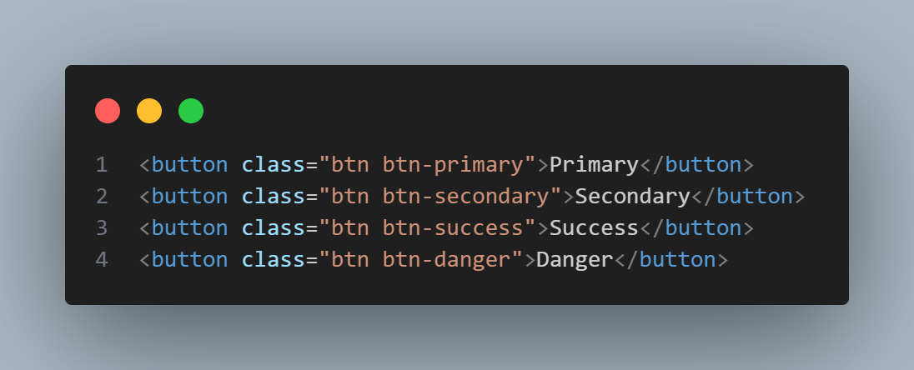

#### 5. Membuat Navbar
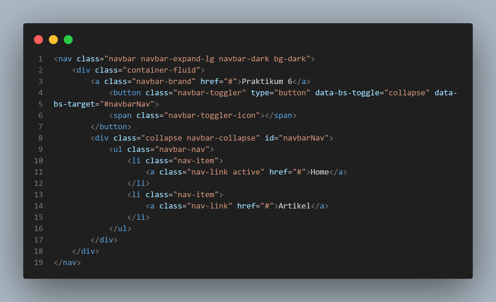

#### 6. Membuat Card
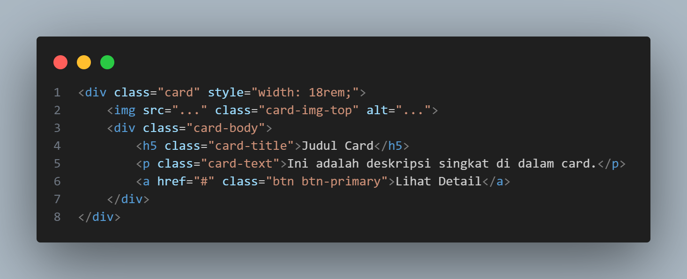

#### 7. Membuat Form
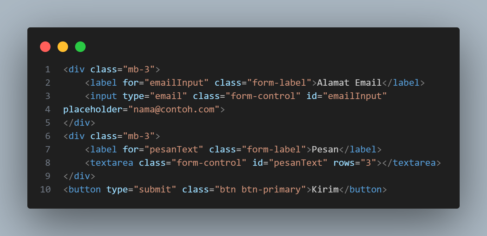

#### Output dari praktikum diatas:
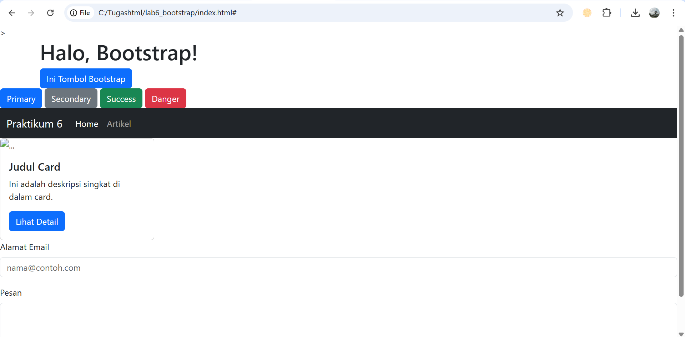

Pertanyaan dan Tugas
1. Refactor Layout Praktikum 4
Ambil layout web sederhana dari Praktikum 4. Buat ulang layout tersebut menggunakan
Bootstrap Grid System.
○ Gunakan "nav" Bootstrap untuk bagian navigasi
○ Gunakan class .row dan .col-md-8 untuk main content dan .col-md-4 untuk sidebar
○ Gunakan komponen .card Bootstrap untuk menggantikan .widget-box
○ Gunakan komponen .card untuk menggantikan .box (bagian "Heading" yang berisi 3
kolom)
○ Anda tidak diperbolehkan menggunakan CSS float atau clear manual.
2. Refactor Form Praktikum 5
Ambil salah satu form dari Praktikum 5 (misalnya Form Input 23atau Form Button 24).

Buat ulang form tersebut agar terlihat rapi menggunakan class-class form Bootstrap (.form-
control, .form-label, .btn).

3. Tugas: Buat Halaman Portfolio Sederhana
Buat satu halaman HTML baru (portfolio.html) menggunakan Bootstrap yang berisi:
a. Sebuah Navbar di bagian atas.
b. Sebuah section "Tentang Saya" di dalam .container dengan 1 baris (.row) dan 2 kolom
(.col):
* Kolom kiri (.col-md-4) berisi foto Anda (gunakan "img" dengan class .img-fluid).
* Kolom kanan (.col-md-8) berisi nama dan deskripsi diri Anda.
c. Sebuah section "Portfolio Saya" di dalam .container dengan 1 baris (.row) dan 3 kolom
(.col-md-4):
* Setiap kolom berisi satu komponen .card yang merepresentasikan satu proyek (beri
gambar dummy dan deskripsi singkat).

Jawaban

### NO. 1
Refactor Layout Praktikum 4
#### Input:
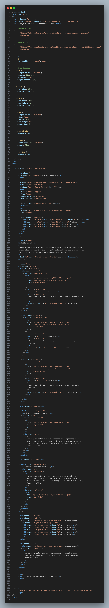

#### Output:
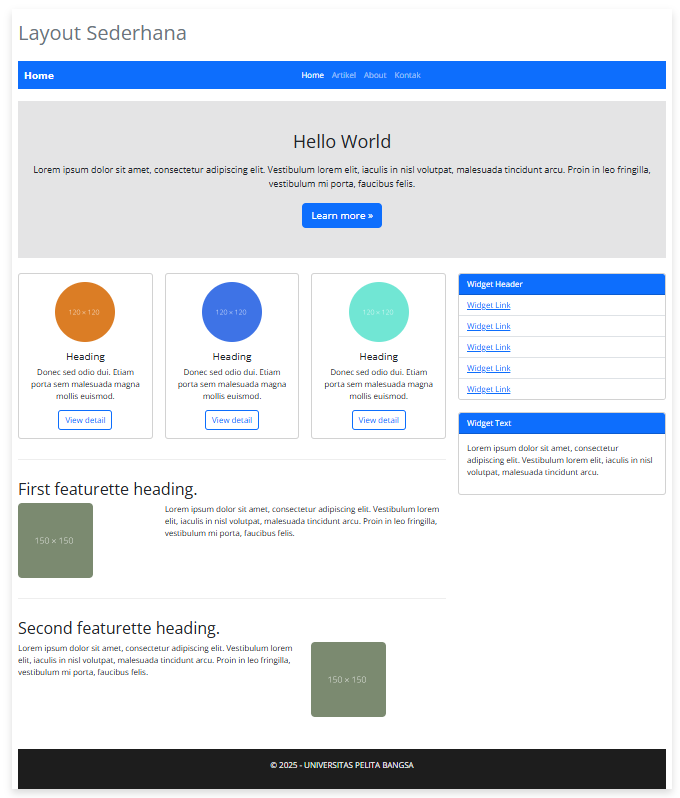

### NO.  2
Refactor Layout Praktikum 5
#### Input:
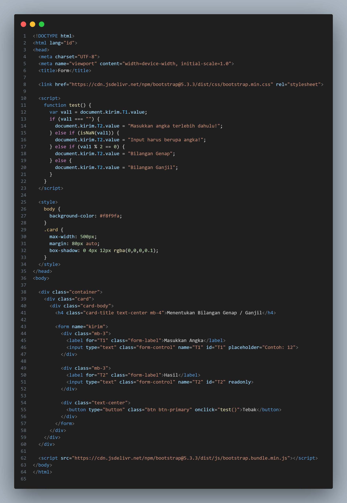

#### Output:
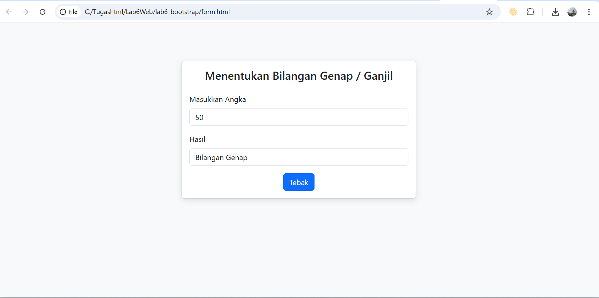

### NO.  3
Halaman protofolio sederhana
#### Input:
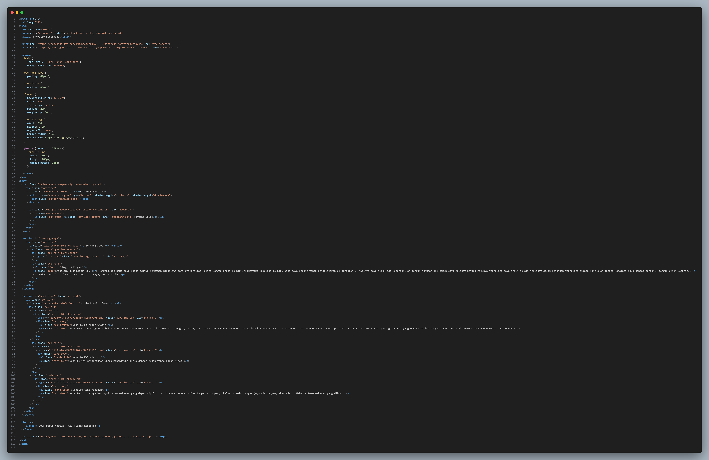

#### Output:
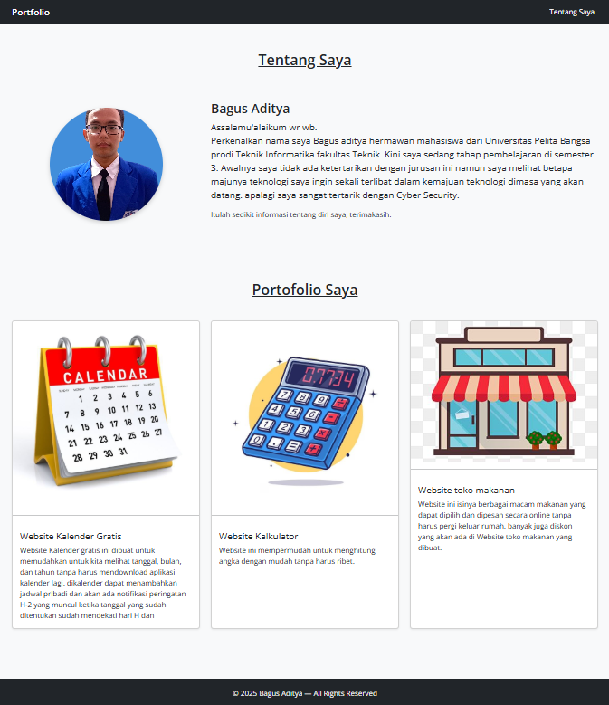

